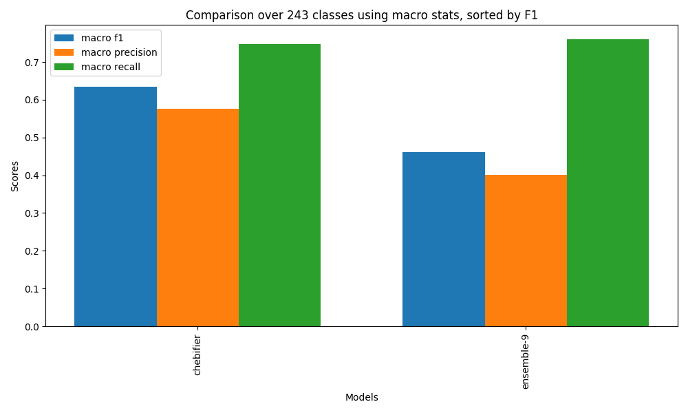
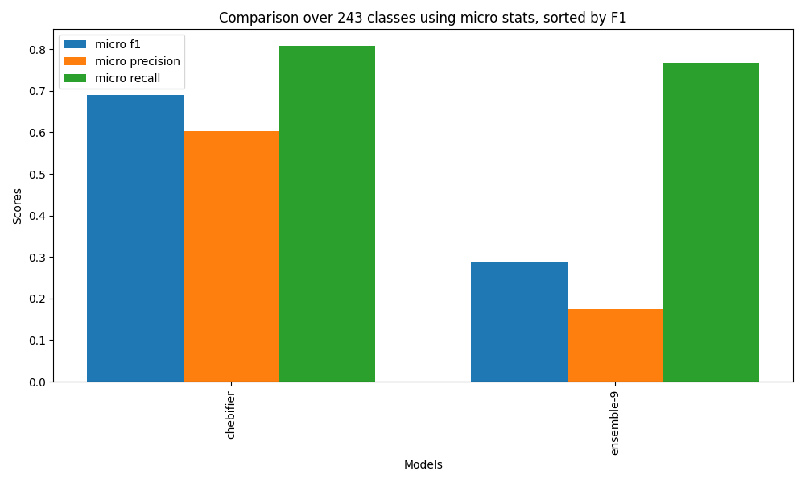

# Chebifier comparison

We evaluated against all held-out examples, and also evaluated against
the state of the art deep learning method, Chebifier. For comparison
we used the 243 classes common to Chebifier and C3PO-Slim. We
calculated micro and macro outcome statistics for 3 metrics (F1,
precision, recall)

## Comparison

Best performing C3POs from all 9 experiments compared with Chebifier. Chebifier. Chebifier beats the ensemble C3PO on f1 and precision, and C3PO marginally wins on recall. 

