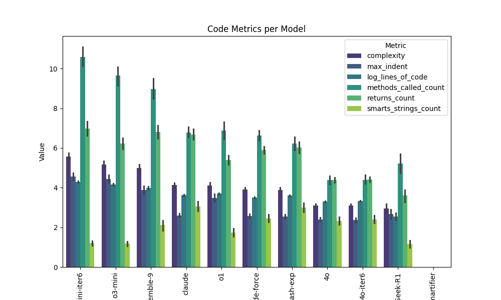

# Code analysis

We analyzed the nature of the generated classifier programs by looking
at different characteristics, such as lines of code, degree of
nesting/indentation, the number of different SMARTS strings used. See
Figure below.

Overall Claude wrote the most involved code, in particular when looking at different RDKit methods used, and the number of return statements (a proxy for branching points in a decision tree). Overall gpt-4o (in all 3 configurations) was the most laconic, favoring shorter, less complex programs. Different models varied widely in how they used SMARTS strings, with Claude averaging the most, and o1 using them the least. 

