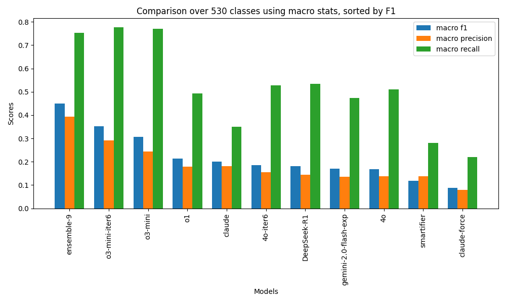
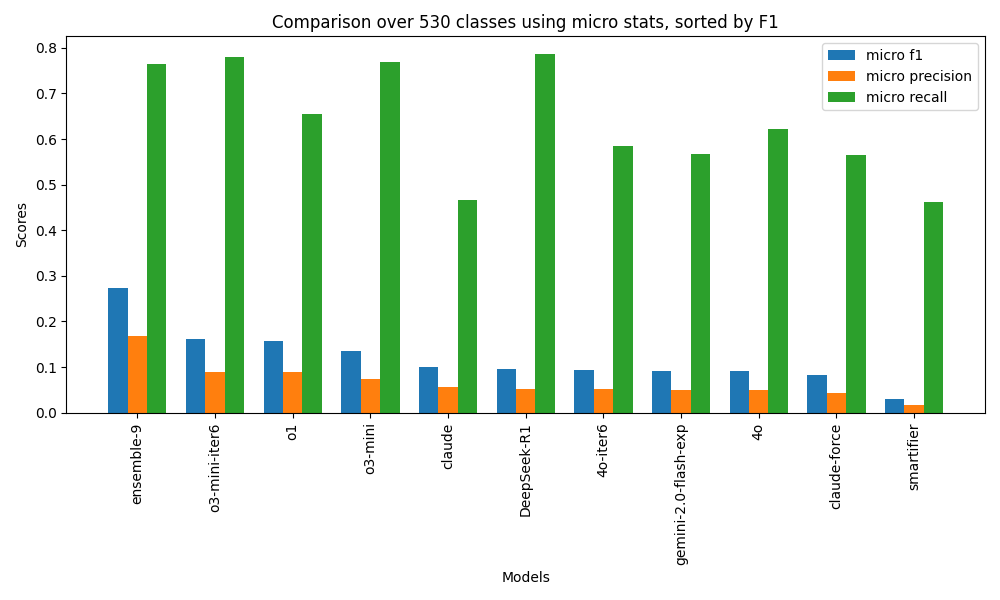
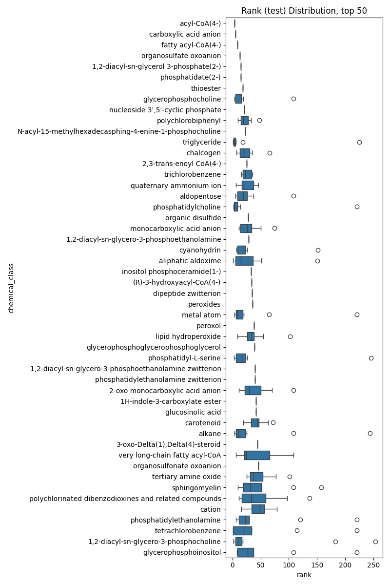
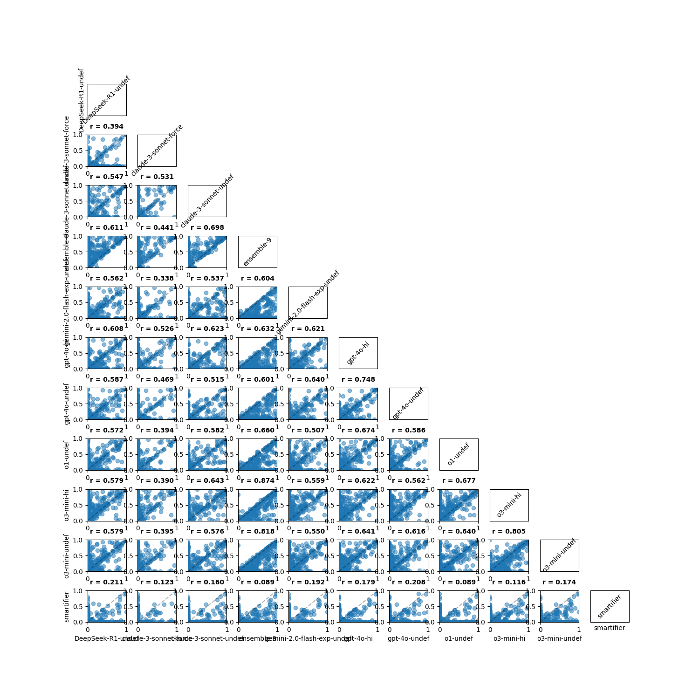

# Performance

## Macro stats

## Micro stats

## Rank distrubution across models

For each model, we ranked each class by f1, and then plotted the
distrubution of ranks across models. This gives a sense of which
classes are consistently learnable, and classes for which models
varied in how well they learned them

## Generalization from training to test data

## Similarity of models

To explore the relative contribution of each approach, we examined the
correlation between f1 scores on each class for each pair of methods
(supplementary methods). In general, there was high correlation
between different C3POs, but less correlation between C3POs and
Chebifier. This indicates that deep learning and program learning
approaches are likely complementary:

