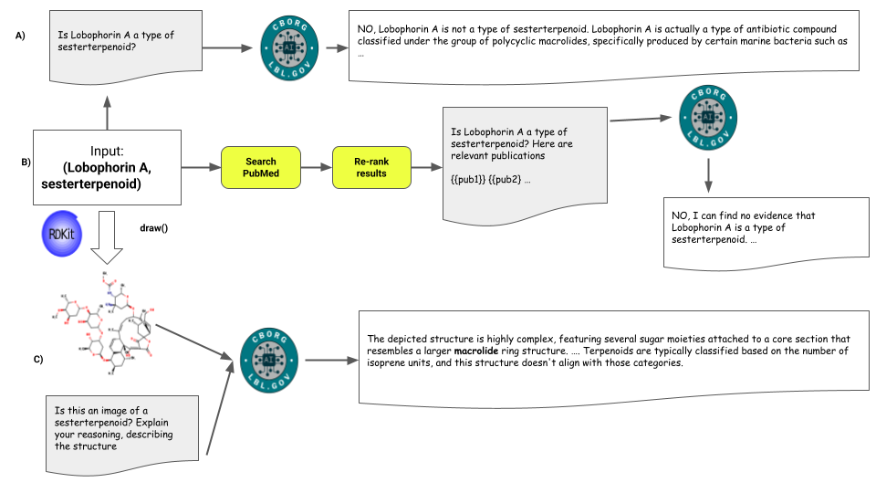

# CheBACR

For any given structure-class pair in the benchmark, we generate a prompt that asks the LLM whether it believes the classification to be accurate, giving a Yes or No answer, plus any explanation. We use the Monarch Initiative LLM-Matrix tool to multiplex this query to multiple separate LLMs to achieve a consensus answer. We use CurateGPT(Caufield et al., 2024) to augment this with a literature search, and provide relevant abstracts as a part of the prompt. The results can be aggregated together, and those for which multiple models are in consensus can be prioritized.

We further augmented this validation using a novel approach in which we generate images for chemical structures (using RDKit, or existing pre-generated images in ChEBI), and use these as inputs to multimodal LLMs, together with a prompt asking the model to examine the image and check the classification. We used gpt-4o as both the vision and text model for this evaluation

Three approaches to validate a classification. (A) LLM as Oracle, ask directly in the query (B) PubMed-RAG via CurateGPT. Most relevant papers to the query are retrieved, then re-ranked based on text embedding similarity, then injected into query (C ) Multimodal vision-text approach. Images are retrieved from ChEBI, or generated via RDKit if not in ChEBI, image is included in a query to classify based on image. In all cases the approaches reject the existing classification.
