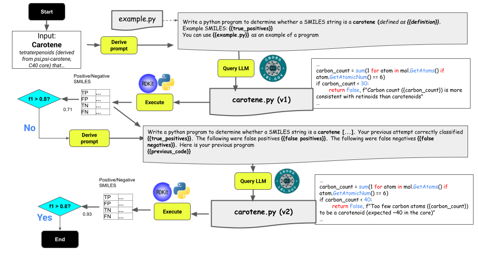

# LEIA

We propose a method called LEIA (Learn-Execute-Iterate-Adapt) that
generates a ChEBI Chemical Classifier Program Ontology (C3PO) using an
iterative process inspired by genetic programming approaches. For each
class *c*, this will generate a program *p<sub>c</sub>* that takes as
input a SMILES string *s*, and yields a tuple *<m,e\>* of a boolean
indicating whether *s* is classified as a member of *c*, plus a
concise explanation for the boolean value.




## Example Learned Program

[alkane.py](https://github.com/chemkg/c3p/blob/main/c3p/programs/alkane.py)

```python
"""
Classifies: CHEBI:18310 alkane
"""
from rdkit import Chem

def is_alkane(smiles: str):
    """
    Determines if a molecule is an alkane based on its SMILES string.
    An alkane is an acyclic, fully saturated hydrocarbon with the general formula CnH2n+2.

    Args:
        smiles (str): SMILES string of the molecule

    Returns:
        bool: True if molecule is an alkane, False otherwise
        str: Reason for classification
    """
    
    # Parse SMILES
    mol = Chem.MolFromSmiles(smiles)
    if mol is None:
        return False, "Invalid SMILES string"

    # Check for rings
    if mol.GetRingInfo().NumRings() > 0:
        return False, "Molecule contains rings"

    # Check for non-carbon and non-hydrogen atoms
    for atom in mol.GetAtoms():
        if atom.GetAtomicNum() not in [1, 6]:  # Only allow H (1) and C (6)
            return False, "Molecule contains non-carbon and non-hydrogen atoms"

    # Check for unsaturation (double or triple bonds)
    if any(bond.GetBondType() not in [Chem.BondType.SINGLE] for bond in mol.GetBonds()):
        return False, "Molecule contains double or triple bonds"

    # Calculate the total number of hydrogens (explicit + implicit)
    h_count = 0
    for atom in mol.GetAtoms():
        h_count += atom.GetTotalNumHs()  # This includes implicit hydrogens

    # Check the general formula CnH2n+2
    c_count = sum(1 for atom in mol.GetAtoms() if atom.GetAtomicNum() == 6)
    
    if h_count != 2 * c_count + 2:
        return False, f"Molecule does not follow the general formula CnH2n+2 (C{c_count}H{h_count})"

    return True, "Molecule is an acyclic, fully saturated hydrocarbon following the general formula CnH2n+2"
```
